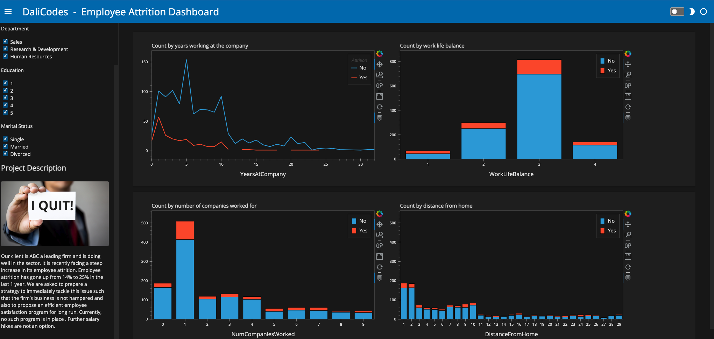

# employee-attrition


code:https://github.com/DaliDalmas/employee-attrition-rate/blob/main/dashboard.ipynb

vodeo explaining the code: 

To run the dashboard:
1. Clone the repo
2. Download the data from the link below and put it in a folder called data inside the repo. data: https://www.kaggle.com/datasets/prachi13/employeeattritionrate
3. Lauch your terminal and cd inside the repo
4. create a virtual environment. `python -m venv venv`
5. activate the virtual environment. `source venv/bin/activate` (for mac and linux)
6. Install the requirements. `pip install -r requirements.txt`
7. run the command below
```
panel serve dashboard.ipynb  --autoreload
```
the autoreload tag helps to automatically reload when the notebook is saved. You can remove the tag when you push your project to production.

